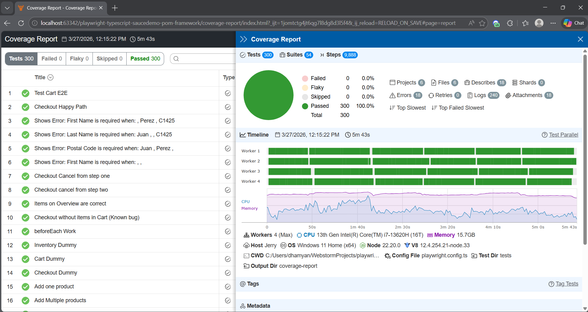

# Playwright + TypeScript + POM Framework
**Production-Ready E2E Automation Framework | SauceDemo**

[](https://www.typescriptlang.org)
[](https://playwright.dev)
[](https://nodejs.org)
[](https://github.com/jerryfinol17/playwright-typescript-saucedemo-pom-framework/actions)
[](https://github.com/jerryfinol17/playwright-typescript-saucedemo-pom-framework)
[](LICENSE.md)
[](https://playwright.dev)

A **scalable and maintainable End-to-End automation framework** built with **Playwright + TypeScript + Page Object Model (POM)**.

Designed with production standards in mind: high code coverage, centralized configuration, automatic evidence collection, and clean architecture ready for any enterprise CI/CD pipeline.

---

### ✨ Key Features

- **Robust Page Object Model** with `BasePage` inheritance for maximum reusability
- Centralized and strongly-typed configuration (credentials, URLs, test data)
- **Data-driven tests** including positive and negative scenarios
- **94% code coverage** using V8 + monocart-reporter
- Automatic evidence collection: **videos, traces, and screenshots** on failure only
- Strict TypeScript throughout the project
- Modern Playwright configuration (smart retries, parallel execution, baseURL, multiple reporters)
- Easily extensible for **API Testing**, Visual Testing, and custom fixtures

---

### 🏗️ Project Structure

```bash
playwright-typescript-saucedemo-pom-framework/
├── pages/           # ← Page Objects (BasePage, LoginPage, InventoryPage...)
├── tests/           # ← Test suites and complete E2E flows
├── docs/            # ← Additional documentation
├── coverage-report/ # ← Generated coverage reports
├── playwright.config.ts
├── package.json
├── tsconfig.json
└── .gitignore
```
### Quick Start (under 2 minutes)
```bash
git clone https://github.com/jerryfinol17/playwright-typescript-saucedemo-pom-framework
cd playwright-typescript-saucedemo-pom-framework

npm install
npx playwright install --with-deps
```
### Run the tests:

```bash
# Run all tests
npx playwright test

# View HTML report
npx playwright show-report

# View coverage report
npx playwright show-report
```

### Reports & Evidence:
- **Beautiful HTML Report** → npx playwright show-report

- **Code Coverage Report** → 94% (V8 + monocart-reporter)

- Videos, traces, and screenshots are **automatically saved** only when tests fail

[E2E.webm](videos/E2E.webm)

###  Code Example (POM)

```bash
// pages/LoginPage.ts
import { BasePage } from './BasePage';

export class LoginPage extends BasePage {
  private usernameInput = this.page.locator('#user-name');
  private passwordInput = this.page.locator('#password');
  private loginButton = this.page.locator('#login-button');

  async login(username: string, password: string) {
    await this.usernameInput.fill(username);
    await this.passwordInput.fill(password);
    await this.loginButton.click();
  }
}
```
### Want to see more?
Explore the /pages and /tests folders.

###  Why This Framework Stands Out

This is **not** just another learning project.

It follows the **exact same architecture** I use when delivering automation frameworks to real clients: Easy to maintain by development and QA teams  
Scalable for large applications  
Ready for CI/CD pipelines (GitHub Actions, Jenkins, GitLab CI)  
Clean migration path from Python, Cypress, or Selenium

I use this as my **base template** for every new automation project.

###  About Me – QA Automation Engineer

I am a **QA Automation Engineer** specialized in building **enterprise-grade automation frameworks** from scratch.

Services I offer:
- Production-ready Playwright + TypeScript + POM frameworks
- Framework migrations (Python → Playwright, Cypress → Playwright, etc.)
- CI/CD integration + advanced reporting

**Looking for a professional automation framework for your team or project?**

Feel free to reach out, and we’ll build one tailored to your needs.

**jerrytareas17@gmail.com (mailto:jerrytareas17@gmail.com)**

### Ready to use it in your next project?
Star the repository and clone it now.


